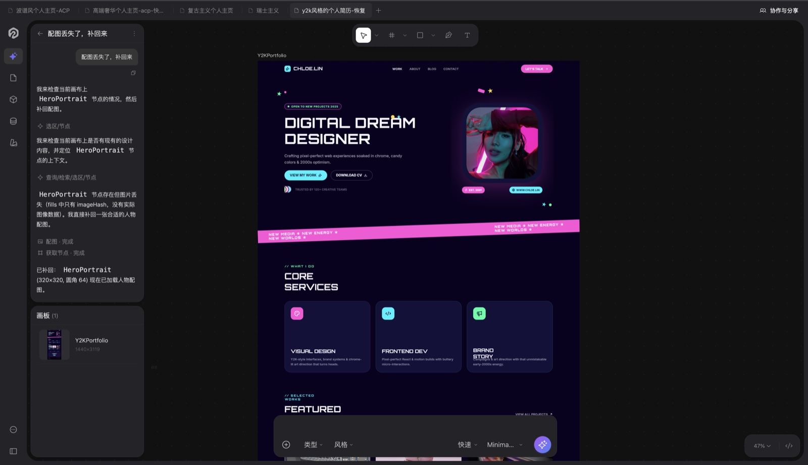
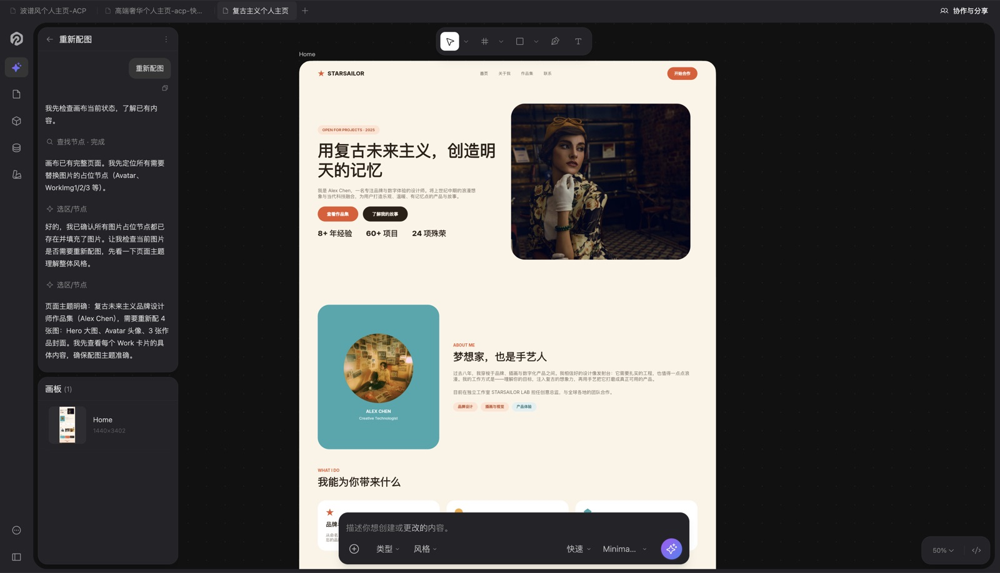
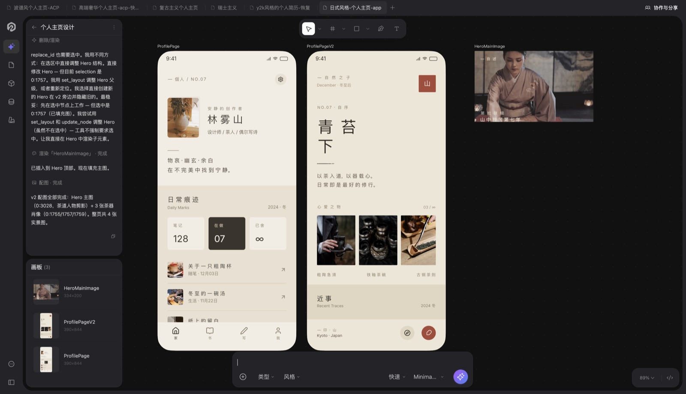

[English](README.md) · [简体中文](README.zh-CN.md) · [繁體中文](README.zh-TW.md) · [日本語](README.ja.md) · [한국어](README.ko.md) · [Deutsch](README.de.md) · **Español** · [Français](README.fr.md) · [Italiano](README.it.md) · [Polski](README.pl.md) · [Русский](README.ru.md) · [Português (Brasil)](README.pt-BR.md) · [हिन्दी](README.hi.md)

# Starry — Tu socio de diseño con IA

<p align="center"></p>

> La herramienta de diseño creada para la colaboración con IA. Local primero, impulsada por ACP y MCP — convierte el lenguaje natural en especificaciones UI precisas y código de producción.

[](https://starry.design)
[](https://trial.starry.design)
[](https://global.starry.design)
[](https://starry.design)
[](https://starry.design/design-to-code.html)
[](https://starry.design)
[](LICENSE)

---

## Descargar Starry

- [Descargar para macOS](https://starry.design/download.html) — macOS
- [Pruébalo en el navegador](https://trial.starry.design)
- Sitio web: [starry.design](https://starry.design) · Sitio global: [global.starry.design](https://global.starry.design)

## Redefine tu flujo de diseño con IA

Starry redefine el flujo de trabajo haciendo que el lienzo sea inteligente, verificable y se conecte sin problemas con tu base de código.

| Función | Descripción |
|---|---|
| **Lienzo impulsado por IA** | Basado en el Agent Client Protocol (ACP). Habla directamente con el lienzo. La IA lee, escribe y genera sistemas de diseño con auto-diseño a partir del lenguaje natural. |
| **Servidor MCP** | Se conecta sin problemas a herramientas de programación con IA como Cursor y Claude mediante el Model Context Protocol. Genera código UI preciso al instante sin salir de tu editor. |
| **CLI para CI/CD** | Los archivos de diseño son código. Usa la CLI para exportar recursos en lote, detectar violaciones tipográficas y comparar cambios de diseño automáticamente durante la revisión de código. |
| **Paridad total de datos con Figma** | Starry permanece perfectamente sincronizado con Figma. Copia de un lienzo y pega en el otro — marcos, texto, componentes y estilos se conservan con total fidelidad. Sin bloqueo, sin caja negra. |

## Starry convierte una frase en una interfaz

Sin código, sin lienzo en blanco — describe la interfaz que quieres y la IA de Starry la genera para ti.

| Escenario | Por qué |
|---|---|
| UI de SaaS / app web (ajustes, CRUD, formularios) | Todos los equipos de software las construyen — el auto-layout más la exportación directa a React (JSX) mantiene el ciclo más corto. |
| Página de aterrizaje / sitio web de marketing | Imprescindible para todo producto y startup — una frase entra, HTML/React sale. |
| Panel de datos / administración | La categoría más grande en B2B — tablas, tarjetas y gráficos son puntos fuertes del auto-layout. |
| UI de app móvil (login, e-commerce, onboarding) | Demanda enorme — posicionado como diseño + prototipo, con exportación HTML para la entrega. |
| Sistema de diseño / biblioteca de componentes | 'Genera un sistema de diseño desde lenguaje natural' — la apuesta más diferenciada. |
| Prototipo rápido / validación de MVP | Prompt → interfaz → código: el camino más rápido para que devs independientes y PMs validen ideas. |

## Diseños que Starry genera

De un solo prompt a pantallas listas para producción. Cada salida mantiene una paridad pixel a pixel con tu base de código.

|  |  |
|---|---|
| *Landing de marketing* | *Pantalla móvil* |

## Cómo se compara Starry

| | Starry | Figma | Stitch | Sketch |
|---|---|---|---|---|
| Generación con IA | 1 sentence → UI | Manual + Figma AI | Text to UI | Manual + Sketch AI |
| Entrega | 0 rework · React (JSX) y HTML | Solo especificaciones, sin componentes | Fragmentos de código | Sketch / PDF |
| Migración | Native .fig import | —（es Figma） | Sin importación nativa | Importa Figma |
| Facilidad de uso | 0 learning curve | Aprender el lienzo | 0 (text) | Aprender Sketch |
| Integración de IA | MCP → editor · ACP → agents | Ninguna | Ninguna | Ninguna |
| Colaboración | Real-time (WebRTC) | Tiempo real | Tiempo real | Tiempo real |
| Precios | Free | $12+/editor | Free | $10/editor |

> Precisión verificada ago 2026. La disponibilidad de funciones puede cambiar — confírmalo en el sitio de cada proveedor.

## Preguntas frecuentes

**¿Starry puede generar una interfaz con IA?**

Sí. Describe lo que quieres con lenguaje natural y la IA de Starry genera la interfaz - diseño, componentes y auto-layout - y exporta código listo para producción (React (JSX) y HTML). Es una UI real, editable y ejecutable, no un mockup estático.

**¿Puedo importar mis archivos de Figma existentes?**

Sí. Starry importa archivos nativos .fig - vectores, texto y estilos se conservan fielmente, y puedes seguir editando en cualquiera de las dos herramientas.

**¿A qué frameworks puedo exportar?**

React (JSX) y HTML puro: todos con paridad de diseño entre el lienzo y el código generado. Tu base de código es dueña del resultado.

**¿Cómo funciona la integración MCP?**

Starry ejecuta un servidor MCP que da a herramientas de IA como Cursor, Claude Code y Codex acceso de lectura y escritura al lienzo. Genera código UI desde tu editor sin cambiar de contexto.

**¿Son privados mis datos de diseño?**

Starry es local-first. Tus archivos permanecen en tu máquina por defecto y pueden versionarse con Git. La colaboración en la nube es opcional y de extremo a extremo cifrada.

**¿Dónde lo consigo?**

Descarga la app de macOS en starry.design o abre la prueba en el navegador en trial.starry.design: sin instalación ni registro.

## Contenido del repositorio

Prompts iniciales, especificaciones de design system y ejemplos listos para Starry. Sin código fuente de la aplicación: la app no es de código abierto.

```
starry-templates/
├── README.md                 # this file (+ 12 localized versions)
├── assets/                   # hero image & real editor screenshots
├── design-systems/
│   └── base-ui.md            # sample Markdown design-system spec
├── prompts/
│   ├── landing-page.md       # marketing landing page
│   ├── saas-settings.md      # settings console with members table
│   ├── analytics-dashboard.md
│   └── mobile-login.md       # login + OTP + onboarding screens
└── docs/
    ├── comparison.md         # Starry vs Figma / Stitch / Sketch
    └── design-to-code.md     # export pipeline & guarantees
```

## Cómo usar

1. Abre Starry: la app de escritorio o la prueba en el navegador.
2. Pega una especificación de design system de `design-systems/` y luego un prompt de `prompts/`.
3. Starry genera capas editables con auto layout: expórtalas a React (JSX) o HTML.

## Enlaces

- [starry.design](https://starry.design)
- [global.starry.design](https://global.starry.design)
- [Download](https://starry.design/download.html)
- [Browser trial](https://trial.starry.design)

## Licencia y desarrollo

- MIT — see [LICENSE](LICENSE).
- Desarrollado y mantenido por SmartAly (Aly) como proyecto de desarrollador independiente.

---

*Starry — Diseño nativo con IA, del lienzo al código.*
