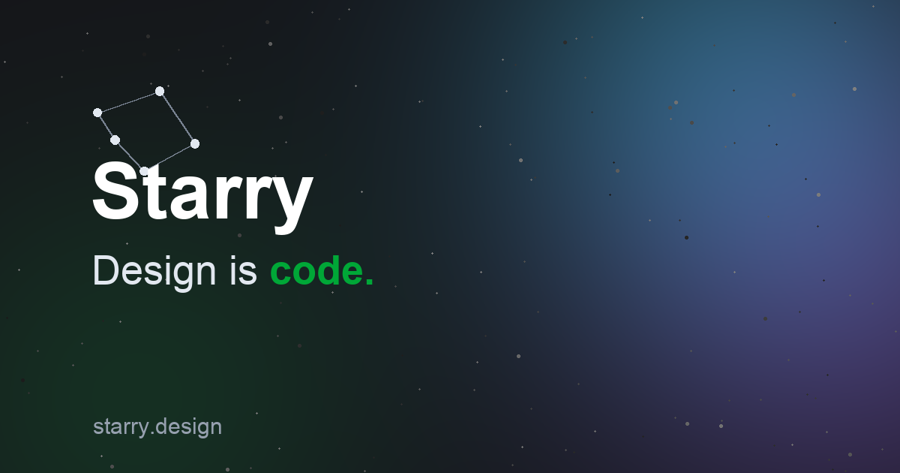

[English](README.md) · [简体中文](README.zh-CN.md) · [繁體中文](README.zh-TW.md) · [日本語](README.ja.md) · [한국어](README.ko.md) · [Deutsch](README.de.md) · [Español](README.es.md) · [Français](README.fr.md) · **Italiano** · [Polski](README.pl.md) · [Русский](README.ru.md) · [Português (Brasil)](README.pt-BR.md) · [हिन्दी](README.hi.md)

# Starry — Il tuo partner di design IA

<p align="center"></p>

<p align="center"></p>

> Lo strumento di design creato per la collaborazione con l'IA. Locale prima di tutto, basato su ACP e MCP — trasforma il linguaggio naturale in specifiche UI precise e codice di produzione.

[](https://starry.design)
[](https://trial.starry.design)
[](https://global.starry.design)
[](https://starry.design)
[](https://starry.design/design-to-code.html)
[](https://starry.design)
[](LICENSE)

---

## Scarica Starry

- [Scarica per macOS](https://starry.design/download.html) — macOS
- [Prova nel browser](https://trial.starry.design)
- Sito web: [starry.design](https://starry.design) · Sito globale: [global.starry.design](https://global.starry.design)

## Ridefinisci il tuo workflow di design IA

Starry ridefinisce il flusso di lavoro rendendo la canvas intelligente, verificabile e connessa senza soluzione di continuità al tuo codebase.

| Funzionalità | Descrizione |
|---|---|
| **Canvas guidata dall'IA** | Basata sul Agent Client Protocol (ACP). Chatta direttamente con la canvas. L'IA legge, scrive e genera nativamente sistemi di design con auto layout a partire dal linguaggio naturale. |
| **Server MCP** | Si connette senza problemi a strumenti di coding IA come Cursor e Claude tramite il Model Context Protocol. Genera codice UI preciso all'istante senza uscire dall'editor. |
| **CLI per CI/CD** | I file di design sono codice. Usa la CLI per esportare asset in batch, rilevare violazioni tipografiche e confrontare le modifiche di design automaticamente durante la code review. |
| **Piena corrispondenza dei dati con Figma** | Starry resta perfettamente sincronizzato con Figma. Copia da una tela, incolla nell'altra — frame, testo, componenti e stili si trasferiscono con piena fedeltà. Nessun lock-in, nessuna scatola nera. |

## Starry trasforma una frase in un'interfaccia

Nessun codice, nessuna tela vuota — descrivi l'interfaccia che vuoi e l'IA di Starry la genera per te.

| Scenario | Perché |
|---|---|
| UI SaaS / app web (impostazioni, CRUD, form) | Ogni team software le costruisce — l'auto-layout più l'export diretto in React (JSX) mantiene il ciclo più breve. |
| Landing page di marketing / sito web | Un must per ogni prodotto e startup — una frase in entrata, HTML/React in uscita. |
| Dashboard dati / pannello admin | La categoria più grande nel B2B — tabelle, card e grafici sono tutti punti di forza dell'auto-layout. |
| UI app mobile (login, e-commerce, onboarding) | Domanda enorme — posizionata come design + prototipo, con export HTML per la consegna. |
| Design system / libreria di componenti | 'Genera un design system dal linguaggio naturale' — la mossa più differenziante. |
| Prototipo rapido / validazione MVP | Prompt → interfaccia → codice: il percorso più veloce per validare idee per dev indie e PM. |

## Design generati da Starry

Da un singolo prompt a schermate pronte per la produzione. Ogni output mantiene una corrispondenza pixel per pixel con la tua codebase.

|  |  |
|---|---|
| *Landing page di marketing* | *Schermo mobile* |

## Come si confronta Starry

| | Starry | Figma | Stitch | Sketch |
|---|---|---|---|---|
| Generazione IA | 1 sentence → UI | Manuale + Figma AI | Text to UI | Manuale + Sketch AI |
| Consegna | 0 rework · React (JSX) e HTML | Solo specifiche, nessun componente | Snippet di codice | Sketch / PDF |
| Migrazione | Native .fig import | —（è Figma） | Nessun import nativo | Importa Figma |
| Facilità d'uso | 0 learning curve | Imparare la canvas | 0 (text) | Imparare Sketch |
| Integrazione IA | MCP → editor · ACP → agents | Nessuna | Nessuna | Nessuna |
| Collaborazione | Real-time (WebRTC) | Tempo reale | Tempo reale | Tempo reale |
| Prezzi | Free | $12+/editor | Free | $10/editor |

> Precisione verificata ago 2026. La disponibilità delle funzioni può cambiare — verifica sul sito di ciascun fornitore.

## Domande frequenti

**Starry può generare un'interfaccia con l'IA?**

Sì. Descrivi ciò che vuoi con parole semplici e l'IA di Starry genera l'interfaccia - layout, componenti e auto-layout - ed esporta codice pronto per la produzione (React (JSX) e HTML). È una UI reale, modificabile ed eseguibile, non un mockup statico.

**Posso importare i miei file Figma esistenti?**

Sì. Starry importa file nativi .fig - vettori, testo e stili si conservano fedelmente, e puoi continuare a rifinire in entrambi gli strumenti.

**Verso quali framework posso esportare?**

React (JSX) e HTML puro — tutti con corrispondenza di layout tra canvas e codice generato. La tua codebase possiede l'output.

**Come funziona l'integrazione MCP?**

Starry esegue un server MCP che dà a strumenti di coding IA come Cursor, Claude Code e Codex accesso in lettura e scrittura al canvas. Genera codice UI dal tuo editor senza cambiare contesto.

**I miei dati di design sono privati?**

Starry è local-first. I tuoi file rimangono sulla tua macchina per impostazione predefinita e possono essere versionati con Git. La collaborazione cloud è opzionale e crittografata end-to-end.

**Dove lo scarico?**

Scarica l’app macOS da starry.design oppure apri la prova nel browser su trial.starry.design — senza installazione e senza registrazione.

## Contenuto del repository

Prompt iniziali, specifiche di design system ed esempi pronti per Starry. Nessun codice sorgente dell’applicazione: l’app resta privata.

```
starry-templates/
├── README.md                 # this file (+ 12 localized versions)
├── assets/                   # hero image & real editor screenshots
├── design-systems/
│   └── base-ui.md            # sample Markdown design-system spec
├── prompts/
│   ├── landing-page.md       # marketing landing page
│   ├── saas-settings.md      # settings console with members table
│   ├── analytics-dashboard.md
│   └── mobile-login.md       # login + OTP + onboarding screens
└── docs/
    ├── comparison.md         # Starry vs Figma / Stitch / Sketch
    └── design-to-code.md     # export pipeline & guarantees
```

## Come si usa

1. Apri Starry: app desktop o prova nel browser.
2. Incolla una spec di design system da `design-systems/`, poi un prompt da `prompts/`.
3. Starry genera livelli auto-layout modificabili: esporta in React (JSX) o HTML.

## Link

- [starry.design](https://starry.design)
- [global.starry.design](https://global.starry.design)
- [Download](https://starry.design/download.html)
- [Browser trial](https://trial.starry.design)

## Licenza & sviluppatore

- MIT — see [LICENSE](LICENSE).
- Sviluppato e mantenuto da SmartAly (Aly) come progetto da sviluppatore indipendente.

---

*Starry — Design nativo IA, dal canvas al codice.*
